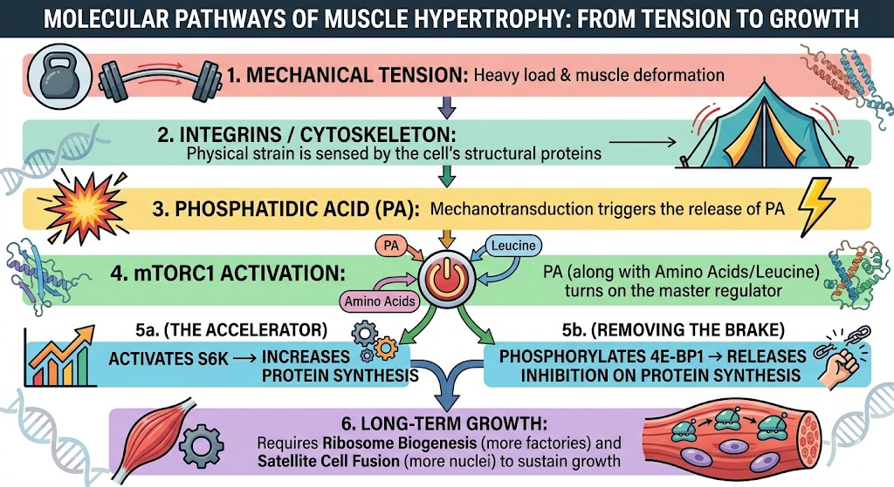

# Chapter 1: The Science of Size — How Growth Occurs

Before you can effectively program for muscle growth, you need to understand what actually drives it. Gym culture is full of anecdotes about “feeling the burn” or “getting a pump,” but the reality of hypertrophy happens on a microscopic, cellular level. If you understand the biological machinery that builds muscle, you can strip away the useless exercises and focus entirely on what works.

## 1.1 The Mechanotransduction Pathway: From Load to Gene Expression

Muscles do not grow because they are holding a weight; they grow because they are deforming under that weight. When you lift something heavy, the physical strain on the muscle fibers triggers a cascade of chemical signals—a process called mechanotransduction.

Think of the muscle cell as a tent. The fabric is the cell membrane (sarcolemma), and the poles are the structural proteins inside (the cytoskeleton). When you apply a heavy load, you pull on those poles. The pulling creates tension that is sensed by specific proteins embedded in the cell’s structure.

The primary sensors are **integrins**—proteins that bridge the outside of the cell to the inside. When the muscle is stretched or placed under high tension, integrins physically deform. This deformation activates an enzyme called **Focal Adhesion Kinase (FAK)**, which sets off a chain reaction inside the cell [1].

Crucially, mechanical tension also triggers the release of **Phosphatidic Acid (PA)** via the enzyme **Phospholipase D (PLD)**. PA is a lipid molecule that acts as a direct chemical messenger. When the cell senses enough deformation, it produces PA, which then seeks out the master switch of muscle growth: **mTORC1** [2].

**Practical Takeaway:** The weight on the bar doesn’t matter if there is no internal tension. You can move a lightweight quickly, but if the muscle fibers aren’t deforming enough to trigger integrins and release PA, the mechanotransduction pathway never turns on. Part II will detail exactly how to create the combination of fiber recruitment and contraction speed that maximizes this deformation.

## 1.2 mTORC1: The Master Regulator

If mechanotransduction is the finger flipping the switch, mTORC1 (mechanistic Target of Rapamycin Complex 1) is the electrical current that powers the factory. mTORC1 is a protein complex that acts as the cell’s master regulator of growth. When mTORC1 is active, the cell builds new proteins; when it’s inactive, the cell remains in a state of breakdown or maintenance.

Once mTORC1 is turned on by mechanical signals (via Phosphatidic Acid) **and** by the presence of amino acids (especially leucine), it phosphorylates two key downstream targets [3]:

- **p70S6 Kinase (S6K):** the accelerator pedal for protein synthesis. mTORC1 activates S6K, which ramps up the translation of mRNA into actual contractile proteins (actin and myosin).
- **4E-BP1:** the brake pedal. Normally, 4E-BP1 blocks protein synthesis. mTORC1 phosphorylates 4E-BP1, effectively removing the brake so synthesis can run freely.

It is important to note that while nutrients (amino acids) and hormones (insulin, IGF-1) can activate mTORC1, they do so with far less potency when mechanical deformation is absent. You can drink a protein shake and spike your insulin, but without the Phosphatidic Acid signal created by high mechanical tension, mTORC1 activation in the muscle remains blunted [4]. This is why even anabolic steroid users who do not train see only minor hypertrophic gains compared to those who combine drugs with heavy resistance training. The mechanical signal is the primary driver; nutrients and hormones provide the raw materials and the metabolic permission slip.

## 1.3 Ribosome Biogenesis & Satellite Cells: Expanding the Factory

Activating mTORC1 is like turning on the assembly line in a factory. But what if the factory only has one machine? You can only make proteins so fast. For long‑term, meaningful hypertrophy, the muscle cell must expand its capacity to build proteins. This requires two things: more machines (ribosomes) and more factory floor space (new nuclei).

### Ribosome Biogenesis

Ribosomes are the cellular machines that read the genetic code and assemble amino acids into proteins. When you consistently apply high mechanical tension, the cell not only uses its existing ribosomes more efficiently but also undergoes **ribosome biogenesis**—the creation of brand‑new ribosomes [5]. This increases the muscle’s *translational capacity*. In simple terms: mTORC1 tells the existing ribosomes to work faster (translational efficiency), but ribosome biogenesis ensures you have more ribosomes working simultaneously, enabling truly large increases in muscle size.

### Satellite Cells and Myonuclear Addition

Muscle fibers are unique because they are multinucleated—each cell contains multiple nuclei (myonuclei). Each nucleus can only manage a certain volume of cytoplasm, a concept known as the **myonuclear domain**. If a muscle fiber grows too large, its existing nuclei can no longer support the demand for protein synthesis.

To overcome this, the muscle recruits **satellite cells**—dormant muscle stem cells that sit on the outside of the fiber. When the fiber is stressed enough through training, satellite cells activate, proliferate, and fuse with the muscle fiber, donating their nuclei [6]. Each new nucleus expands the myonuclear domain, giving the cell the “managerial capacity” to sustain larger volumes of muscle.

**Practical Takeaway:** This is why muscle memory is real. Once a satellite cell donates a nucleus to a muscle fiber, that nucleus appears to be retained long‑term, even if you stop training and lose muscle size [7]. When you resume training, you don’t have to wait for satellite cell fusion—you already have the nuclear infrastructure, so growth happens much faster the second time around.

---

### References

[1] Klossner RD, et al. The activation of mTOR signaling requires the integrin-linked kinase and focal adhesion kinase. *J Physiol.* 2009. PMID: 19221120  
[2] Hornberger TA, et al. Mechanisms of IGF-I-induced mechanotransduction and mTOR signaling in skeletal muscle. *J Appl Physiol.* 2006. PMID: 17090540  
[3] Drummond MJ, et al. Rapamycin administration in humans blocks the contraction-induced increase in skeletal muscle protein synthesis. *J Physiol.* 2009. PMID: 19228591  
[4] Moore DR, et al. Leucine and protein synthesis: mTOR and beyond. *Nutr Rev.* 2011. PMID: 21967277  
[5] Figueiredo VC, et al. Ribosome biogenesis and skeletal muscle hypertrophy: The role of mTORC1. *J Appl Physiol.* 2021. PMID: 33323937  
[6] Van der Meer SF, et al. Muscle stem cells: The role of satellite cells in hypertrophy. *J Physiol.* 2011. PMID: 21613575  
[7] Gundersen K. Muscle memory and a new cellular model for muscle atrophy and hypertrophy. *J Exp Biol.* 2016. PMID: 27492978